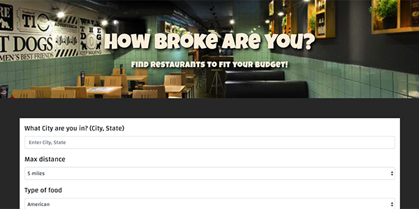

# How Broke are You? The food finder app based on price
By Hanna, Nenye, Habib, &amp; Marie

Input your city and state. Then choose a food type from the dropdown list of options, how far you're willing to travel, and your price range. The app returns restaurant results with chosen criteria and gifs of the type of food you chose.

**Deployed App:** https://bourneid7.github.io/project-1/

## Getting Started
No installations are required to run this simple app on a development server. Simply clone the repo.

## Technologies Used
* JavaScript
* HTML5/CSS3
* Bootstrap CSS
* Zomato API
* Giphy API

